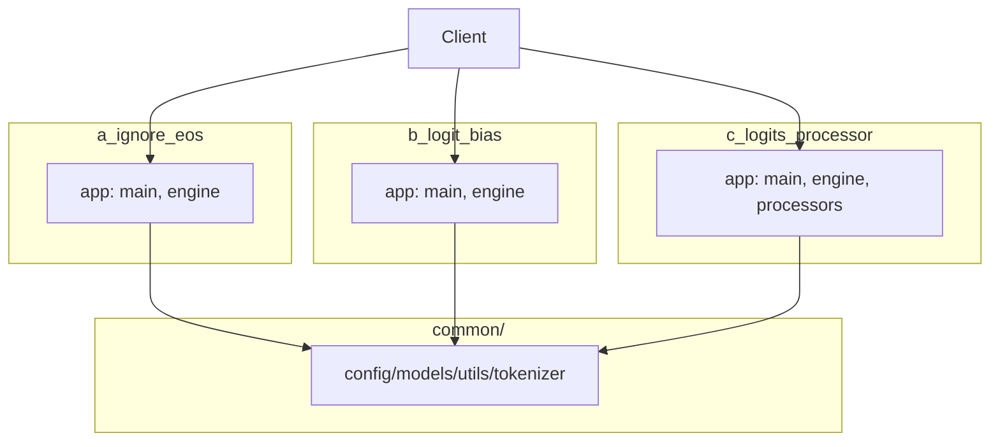

# EOS Suppression Patterns: Code Separation Plan

Goal: Host three EOS-suppression patterns side-by-side in this repo without duplicating shared assets (docs/, scripts/, etc.). Keep each pattern independently runnable and testable.

## Feasibility

- Possible with a “multi-variant” layout under a common monorepo.
- Shared modules (config, models, utilities) can live in a common package.
- Each pattern gets its own FastAPI app entry, engine, tests, and env.

## Proposed Layout

```
.
├─ common/                     # shared code (no duplication)
│  ├─ __init__.py
│  ├─ config.py                # Settings loader (moved from app/config.py)
│  ├─ models.py                # Pydantic models (moved from app/models.py)
│  ├─ utils/
│  │  ├─ __init__.py
│  │  ├─ logging.py
│  │  └─ text_sanitize.py
│  └─ inference/
│     ├─ __init__.py
│     └─ tokenizer.py
├─ src/
│  ├─ a_ignore_eos/
│  │  ├─ app/
│  │  │  ├─ __init__.py
│  │  │  ├─ main.py            # FastAPI entry for Pattern A
│  │  │  └─ engine.py          # uses ignore_eos + (optional) second pass
│  │  ├─ tests/
│  │  │  └─ test_engine.py
│  │  └─ .env.example
│  ├─ b_logit_bias/
│  │  ├─ app/
│  │  │  ├─ __init__.py
│  │  │  ├─ main.py            # FastAPI entry for Pattern B
│  │  │  └─ engine.py          # uses negative EOS logit bias
│  │  ├─ tests/
│  │  │  └─ test_engine.py
│  │  └─ .env.example
│  └─ c_logits_processor/  # current implementation lives here
│     ├─ app/
│     │  ├─ __init__.py
│     │  ├─ main.py            # FastAPI entry for Pattern C
│     │  ├─ engine.py          # current engine with MinCharLengthProcessor
│     │  └─ processors.py      # MinCharLengthProcessor
│     ├─ tests/
│     │  └─ test_minlen_processor.py
│     └─ .env.example
├─ tests_shared/               # optional: tests for common/ modules
│  └─ test_text_utils.py
├─ scripts/                    # shared, unchanged
├─ docs/                       # shared, unchanged
└─ pyproject.toml              # single environment for all variants
```

Notes:
- Keep `docs/` and `scripts/` shared (per your constraint).
- Move current `app/` implementation into `src/c_logits_processor/`.
- Create `common/` for shared modules, imported by all patterns.

## Pattern-Specific Logic

- Pattern A (ignore_eos) — Deprecated:
  - Not supported with current `llama-cpp-python` (0.3.x) because `ignore_eos` is not a valid parameter in `create_completion`.
  - Keep for historical reference only. Prefer Pattern B (EOS `logit_bias`) to approximate “ignore until min length”, or Pattern C for a logits-processor approach.
- Pattern B (logit_bias):
  - Strategy: provide strong negative bias for EOS in `logit_bias` at call time. Keep single pass; bias removed only if doing a two-stage call (optional).
  - Naturalness biased; not absolute.
- Pattern C (logits processor):
  - Strategy: current `MinCharLengthProcessor` to suppress EOS before threshold, then release and lightly bias sentence terminators.
  - Single pass; best control; already implemented.

## Running Variants (shared scripts)

- Keep `scripts/dev.sh` and `scripts/run_server.sh` unchanged.
- Select variant by module path via env var `APP_MODULE` (no duplication of scripts):
  - Pattern A: [Deprecated] `APP_MODULE=src.a_ignore_eos.app.main:app` (not recommended)
  - Pattern B: `APP_MODULE=src.b_logit_bias.app.main:app`
  - Pattern C: `APP_MODULE=src.c_logits_processor.app.main:app`
- Example:
```
APP_MODULE=src.c_logits_processor.app.main:app \
  uv run uvicorn $APP_MODULE --reload
```

Alternative: provide three tiny wrapper scripts under `scripts/` that set `APP_MODULE` and invoke uvicorn.

## Tests

- Each pattern has its own `tests/` covering engine behavior for that pattern.
- Shared utilities tested under `tests_shared/`.
- CI/EC2 can run per-pattern suites:
```
pytest -q src/a_ignore_eos/tests
pytest -q src/b_logit_bias/tests
pytest -q src/c_logits_processor/tests
```

## Env Files

- Each pattern ships its own `.env.example` tuned to its defaults:
  - Pattern A: MIN_LEN high, MAX_LEN moderate; flags for second-pass enabled.
  - Pattern B: `EOS_BIAS` default (e.g., -10.0).
  - Pattern C: `PUNCT_BIAS`, etc.
- For EC2/systemd, use separate service files if running multiple variants simultaneously.

## Packaging

- Single `pyproject.toml` at root; all packages are importable via editable install.
- Ensure `__init__.py` exists for `common/`, `src/` and each subfolder.
- No need for multiple virtualenvs unless dependency sets diverge (they do not).

## Migration Steps (from current tree)

1) Create `common/` and move shared modules:
   - `app/config.py` → `common/config.py`
   - `app/models.py` → `common/models.py`
   - `app/utils/*` → `common/utils/*`
   - `app/inference/tokenizer.py` → `common/inference/tokenizer.py`
2) Create `src/c_logits_processor/` and move:
   - `app/inference/engine.py` → `src/c_logits_processor/app/engine.py`
   - `app/inference/processors.py` → `src/c_logits_processor/app/processors.py`
   - `app/main.py` → `src/c_logits_processor/app/main.py`
   - `app/routers/chat.py` → `src/c_logits_processor/app/routers/chat.py`
3) Implement Pattern A and B engines and `main.py` using `common/` modules.
4) Update imports in all pattern apps to reference `common.*`.
5) Add `__init__.py` files and verify imports.
6) Update docs and example commands to use `APP_MODULE` pattern selection.

## Trade-offs

- Pros: Clear separation by pattern, minimal duplication, easy A/B/C testing.
- Cons: Slightly more import indirection via `common/`; path-based selection requires discipline in scripts/ops.
- Mitigation: Keep shared interfaces stable (e.g., `generate(messages, min_len, max_len)`), so routers stay identical across patterns.

## Minimal Diagram



This keeps docs/ and scripts/ shared, while each pattern has its own app/, tests/, and env file.
