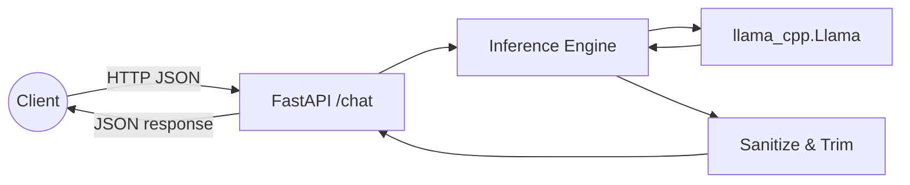
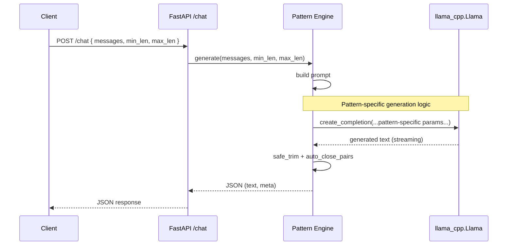

# Architecture Overview

This API adds character-length control to chat generation on llama.cpp (via llama-cpp-python). It implements three distinct patterns for EOS suppression, each with different trade-offs between control, naturalness, and implementation complexity.

## Pattern Selection Guide

| Pattern | Status | Best For | Trade-offs |
|---------|--------|----------|------------|
| **[Pattern A: ignore_eos](pattern-a-architecture.md)** | ⚠️ Deprecated | Historical reference | Requires unsupported `ignore_eos` parameter |
| **[Pattern B: logit_bias](pattern-b-architecture.md)** | ✅ Recommended | Simplicity + naturalness | Strong guidance, not absolute control |
| **[Pattern C: logits_processor](pattern-c-architecture.md)** | ✅ Advanced | Precise control + streaming | Higher implementation complexity |

**Quick Recommendations:**
- **Start with Pattern B** for most use cases (good balance)
- **Use Pattern C** for precise control and optimal streaming UX
- **Avoid Pattern A** (deprecated - use Pattern B instead)

## Project Structure

This project uses a multi-pattern layout with shared components:

```
├── common/                    # Shared across all patterns
│   ├── config.py             # Settings and environment loading
│   ├── models.py             # Pydantic request/response models  
│   ├── utils/                # Text sanitization, logging
│   └── inference/            # Tokenizer utilities
├── src/
│   ├── a_ignore_eos/         # Pattern A (deprecated)
│   ├── b_logit_bias/         # Pattern B (logit bias)
│   └── c_logits_processor/   # Pattern C (custom processor)
├── docs/architecture/        # Pattern-specific architecture docs
└── scripts/                  # Shared development scripts
```

### Common Components

- **Config:** Environment-based settings (`common/config.py`)
- **Models:** Pydantic request/response schemas (`common/models.py`)
- **Utils:** Text sanitization, logging, character counting
- **Inference:** Shared tokenizer utilities

### Pattern-Specific Components

Each pattern has its own:
- **FastAPI app:** Entry point with `/chat` and `/health` endpoints
- **Engine:** Pattern-specific generation logic
- **Tests:** Unit and integration tests
- **Configuration:** Pattern-tuned `.env.example`

## Version Policy

- Python: 3.12.x (CUDA wheels for llama-cpp-python officially support 3.10–3.12).
- FastAPI: 0.117.x (latest stable minor, e.g., 0.117.1).
- llama-cpp-python: 0.3.x (CPU or CUDA cu12x wheels).

## Prerequisites

- Python 3.12; cmake >= 3.26; compiler toolchain (build-essential or Xcode CLT).
- Optional GPU: NVIDIA driver + CUDA 12.x to use cu12x wheels.
- GGUF model file path (MODEL_PATH) sized for your context window.

## Project Scaffolding

Key structure (condensed):

```
app/
  main.py  routers/chat.py
  inference/engine.py processors.py tokenizer.py
  utils/logging.py utils/text_sanitize.py
  models.py config.py schemas/response.py
scripts/ (dev.sh, run_server.sh)
tests/ (unit tests)
docs/ (architecture, deployment, guidelines)
```

## Packaging & Dependencies

Minimal pyproject (pinned ranges):

```
[project]
requires-python = ">=3.12,<3.13"
dependencies = [
  "fastapi>=0.117,<0.118",
  "uvicorn[standard]>=0.30,<0.31",
  "pydantic>=2.8,<3.0",
  "llama-cpp-python>=0.3,<0.4",
  "python-dotenv>=1.0,<2.0",
]
```

Install:
- uv: `uv venv && uv pip install -e .`
- venv/pip: `python3.12 -m venv .venv && source .venv/bin/activate && pip install -e .`
- CUDA wheel (example CUDA 12.4): `pip install --extra-index-url https://abetlen.github.io/llama-cpp-python/whl/cu124 "llama-cpp-python>=0.3,<0.4"`

## High-Level Flow



## General Request Flow




## Pattern Selection & Deployment

### Running Different Patterns

Select patterns using the `APP_MODULE` environment variable:

```bash
# Pattern A (deprecated - not recommended)
APP_MODULE=src.a_ignore_eos.app.main:app uvicorn $APP_MODULE

# Pattern B (recommended for most use cases)  
APP_MODULE=src.b_logit_bias.app.main:app uvicorn $APP_MODULE

# Pattern C (advanced - precise control)
APP_MODULE=src.c_logits_processor.app.main:app uvicorn $APP_MODULE
```

### Configuration

Each pattern has its own `.env.example` with tuned defaults:
- **Pattern A:** Higher `MIN_LEN`, `SECOND_PASS` enabled
- **Pattern B:** `EOS_BIAS` settings, optional `SECOND_PASS`  
- **Pattern C:** Standard length controls, optional punctuation bias

### Deployment Options

- **Development:** Use `scripts/dev.sh` with `APP_MODULE` selection
- **Production:** systemd service with pattern-specific module path
- **Hardware:** CPU or CUDA wheels for `llama-cpp-python` depending on instance

## Notes

- Scope is intentionally narrow: single `/chat` endpoint, JSON only.
- Processor focuses on character-length; advanced formatting/streaming is out-of-scope initially.
