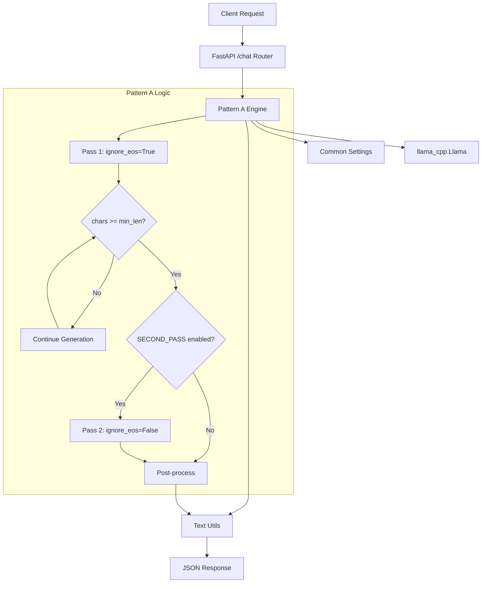
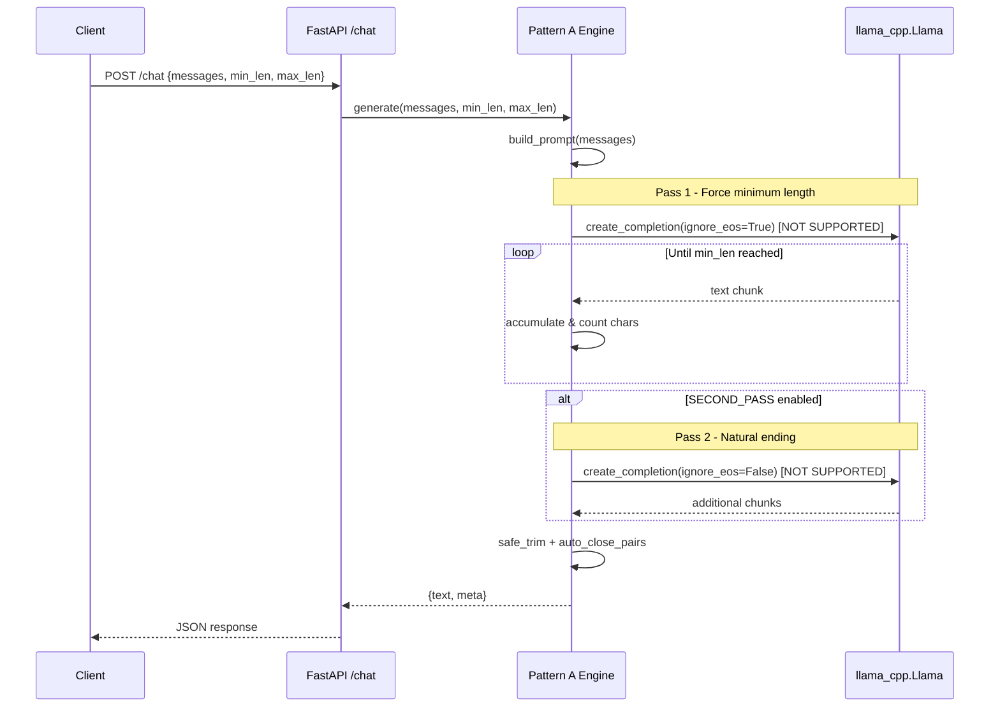

# Pattern A Architecture: ignore_eos [Deprecated]

**⚠️ Deprecated:** This pattern relies on the `ignore_eos` parameter which is not supported in llama-cpp-python 0.3.x. Use Pattern B (logit_bias) or Pattern C (logits_processor) instead.

## Overview

Pattern A was designed to guarantee minimum character length by completely ignoring EOS tokens until the threshold is reached, optionally followed by a second pass for natural endings.

## Component Architecture



## Engine Strategy

### Single-Pass Approach (A.1)
```python
# Not supported - requires ignore_eos parameter
def generate_single_pass(messages, min_len, max_len):
    # This would use: ignore_eos=True until min_len reached
    # Then stop generation
    pass
```

### Two-Pass Approach (A.2)
```python
# Historical reference - not implementable
def generate_two_pass(messages, min_len, max_len):
    # Pass 1: ignore_eos=True until min_len
    # Pass 2: ignore_eos=False for natural ending
    pass
```

## Configuration Parameters

```bash
# Pattern A specific (.env.example)
MIN_LEN=180          # Higher default for guaranteed length
MAX_LEN=300          # Moderate ceiling
SECOND_PASS=true     # Enable natural ending
SECOND_PASS_TOKENS=48 # Budget for clean stop
```

## Request Flow



## Meta Response Fields

```json
{
  "text": "Generated response...",
  "meta": {
    "strategy": "ignore_eos",
    "second_pass_used": true,
    "min_len": 180,
    "max_len": 300,
    "generated_chars": 245,
    "returned_chars": 245,
    "usage": {...}
  }
}
```

## Implementation Status

**Current Status:** Not implementable with llama-cpp-python 0.3.x

**Workaround:** Use Pattern B with strong negative EOS bias:
- `EOS_BIAS=-15.0` or stronger
- Enable `SECOND_PASS=true` for natural endings

## Testing Strategy

```python
# Unit tests would verify (if implementable):
def test_minimum_length_enforcement():
    # Should never return < min_len characters
    pass

def test_second_pass_improvement():
    # Should improve sentence endings when enabled
    pass

def test_max_length_trimming():
    # Should respect max_len via safe_trim
    pass
```

## Migration Path

**Recommended:** Migrate to Pattern B (logit_bias) for similar behavior:

1. Use strong negative `EOS_BIAS` (e.g., -12.0 to -18.0)
2. Enable `SECOND_PASS=true` for natural endings
3. Adjust `MIN_LEN`/`MAX_LEN` as needed
4. Test output quality and adjust bias strength

This provides similar minimum length enforcement while maintaining compatibility with current llama-cpp-python bindings.