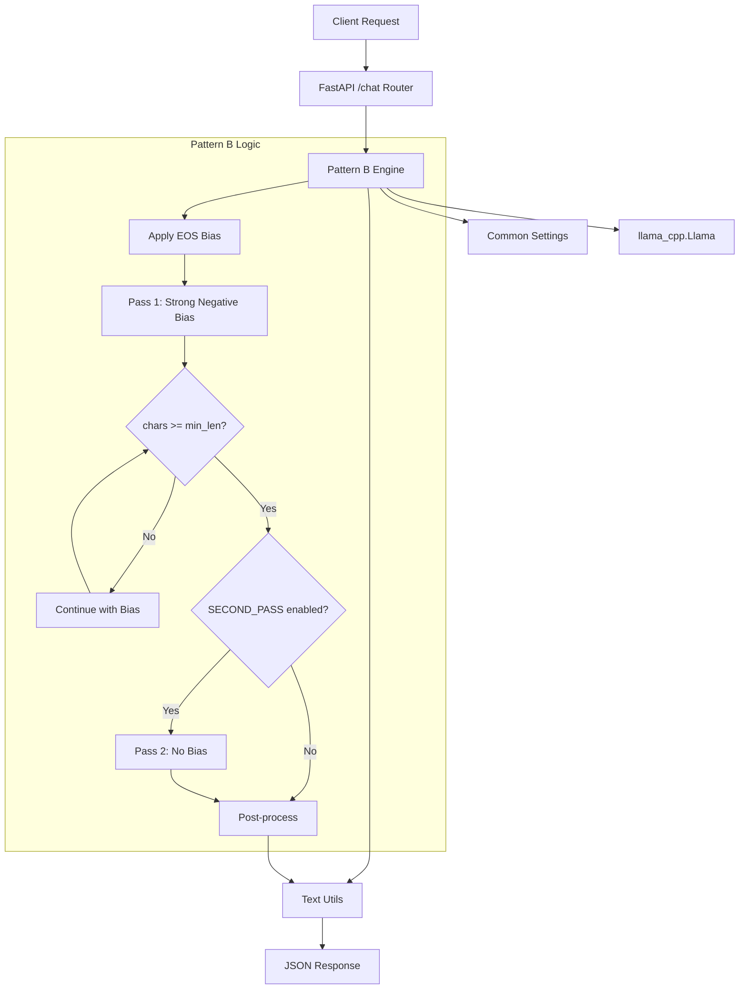
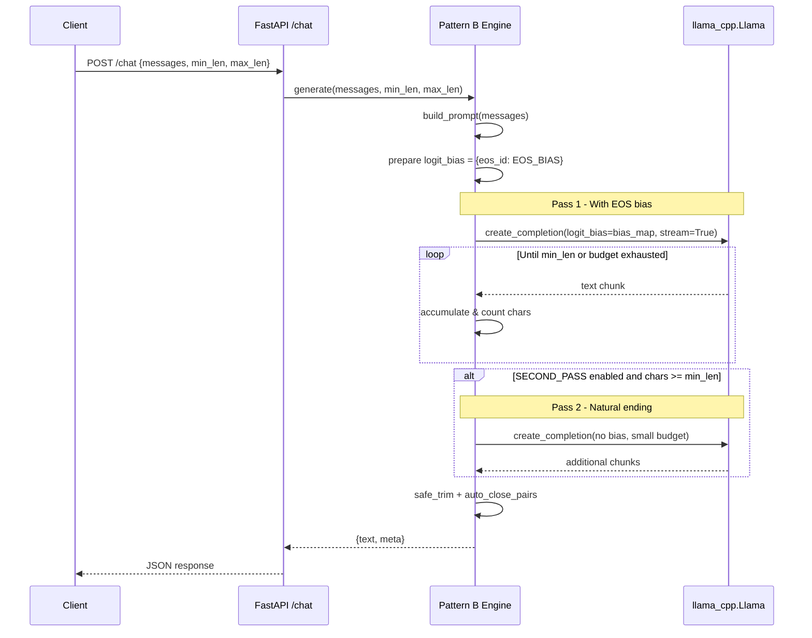
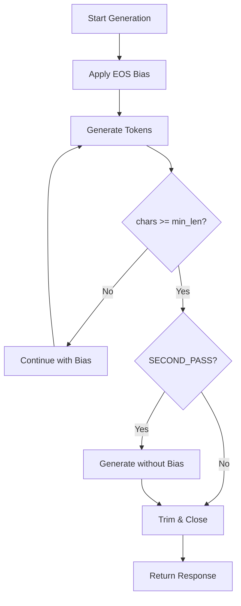

# Pattern B Architecture: logit_bias

## Overview

Pattern B uses negative logit bias to suppress EOS token probability until minimum character length is likely achieved. This provides strong guidance while maintaining naturalness in generation.

## Component Architecture



## Engine Strategy

### Single-Pass Approach (B.1)
```python
def generate_single_pass(messages, min_len, max_len):
    # Apply strong negative bias to EOS token
    eos_bias = float(os.getenv("EOS_BIAS", "-10.0"))
    bias_map = {eos_id: eos_bias} if eos_id else None
    
    # Generate with bias throughout
    stream = llama.create_completion(
        prompt=prompt,
        max_tokens=max_tokens,
        logit_bias=bias_map,
        stream=True
    )
    # Accumulate until min_len or token budget reached
```

### Two-Pass Approach (B.2)
```python
def generate_two_pass(messages, min_len, max_len):
    # Pass 1: With EOS bias until min_len
    first_pass = generate_with_bias(prompt, bias_map)
    
    if chars >= min_len and SECOND_PASS:
        # Pass 2: Without bias for natural ending
        second_pass = generate_without_bias(
            prompt + first_pass, 
            small_token_budget
        )
        return first_pass + second_pass
    
    return first_pass
```

## Configuration Parameters

```bash
# Pattern B specific (.env.example)
EOS_BIAS=-10.0          # Negative bias strength
SECOND_PASS=false       # Enable clean ending pass
SECOND_PASS_TOKENS=32   # Budget for natural stop
MIN_LEN=120             # Target minimum length
MAX_LEN=240             # Hard maximum limit
```

## Bias Strength Guidelines

| EOS_BIAS | Behavior | Use Case |
|----------|----------|----------|
| -4.0 to -6.0 | Light guidance | Subtle length increase |
| -8.0 to -12.0 | Strong guidance | Recommended default |
| -12.0 to -18.0 | Very strong | Near-guarantee of min_len |
| < -20.0 | May cause artifacts | Not recommended |

## Request Flow



## Length Control Logic



## Meta Response Fields

```json
{
  "text": "Generated response with proper length...",
  "meta": {
    "strategy": "logit_bias",
    "eos_bias": -10.0,
    "second_pass_used": true,
    "min_len": 120,
    "max_len": 240,
    "generated_chars": 185,
    "returned_chars": 185,
    "usage": {
      "prompt_tokens": 45,
      "completion_tokens": 62,
      "total_tokens": 107
    }
  }
}
```

## Implementation Details

### EOS Token Detection
```python
def _ensure_llama(model_path=None):
    # Initialize model and detect EOS token ID
    try:
        _eos_id = _llama.token_eos()
    except Exception:
        try:
            # Fallback for models using </s>
            _eos_id = _llama.tokenize("</s>", add_bos=False, special=True)[0]
        except Exception:
            _eos_id = None
    return _llama
```

### Bias Application
```python
def apply_eos_bias():
    eos_bias = float(os.getenv("EOS_BIAS", "-10.0"))
    bias_map = {}
    if _eos_id is not None:
        bias_map[_eos_id] = eos_bias
    return bias_map if bias_map else None
```

## Testing Strategy

```python
def test_eos_bias_application():
    # Verify bias reduces EOS probability
    
def test_minimum_length_guidance():
    # Strong bias should increase average length
    
def test_second_pass_naturalness():
    # Second pass should improve sentence endings
    
def test_bias_strength_scaling():
    # Stronger bias should produce longer outputs
```

## Performance Characteristics

- **Latency:** Single-pass is fastest, two-pass adds overhead
- **Quality:** Good balance of length control and naturalness  
- **Streaming:** Works well with SSE streaming
- **Resource Usage:** Minimal overhead from logit bias

## Failure Modes & Mitigations

| Issue | Cause | Mitigation |
|-------|--------|------------|
| Still short outputs | Weak bias | Increase `EOS_BIAS` magnitude |
| Unnatural endings | Strong bias | Enable `SECOND_PASS=true` |
| Run-on sentences | Very strong bias | Reduce bias, adjust temperature |
| Inconsistent results | Model sensitivity | Fine-tune bias per model |

## Recommended Settings

### Conservative (Natural)
```bash
EOS_BIAS=-8.0
SECOND_PASS=true
SECOND_PASS_TOKENS=24
```

### Balanced (Default)
```bash
EOS_BIAS=-10.0
SECOND_PASS=false
SECOND_PASS_TOKENS=32
```

### Aggressive (Guaranteed Length)
```bash
EOS_BIAS=-15.0
SECOND_PASS=true
SECOND_PASS_TOKENS=48
```