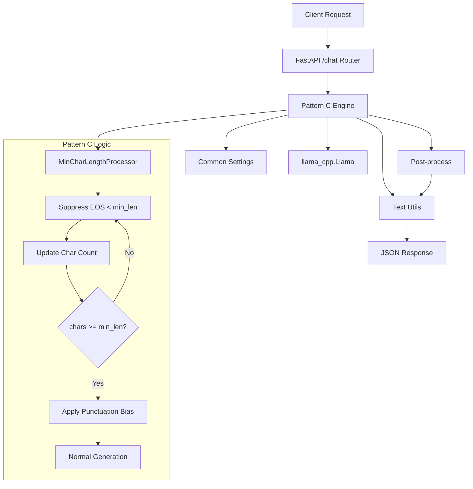
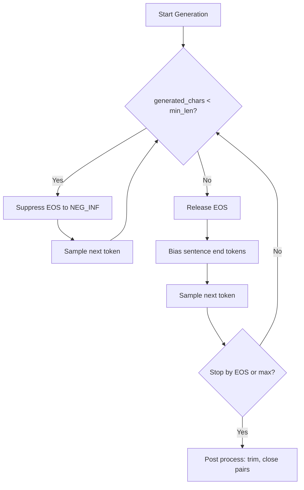
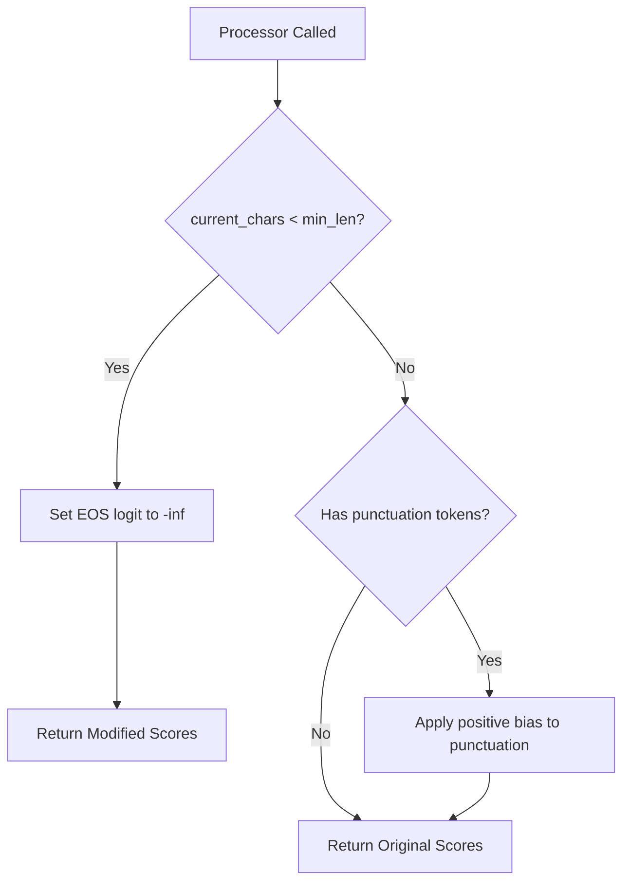
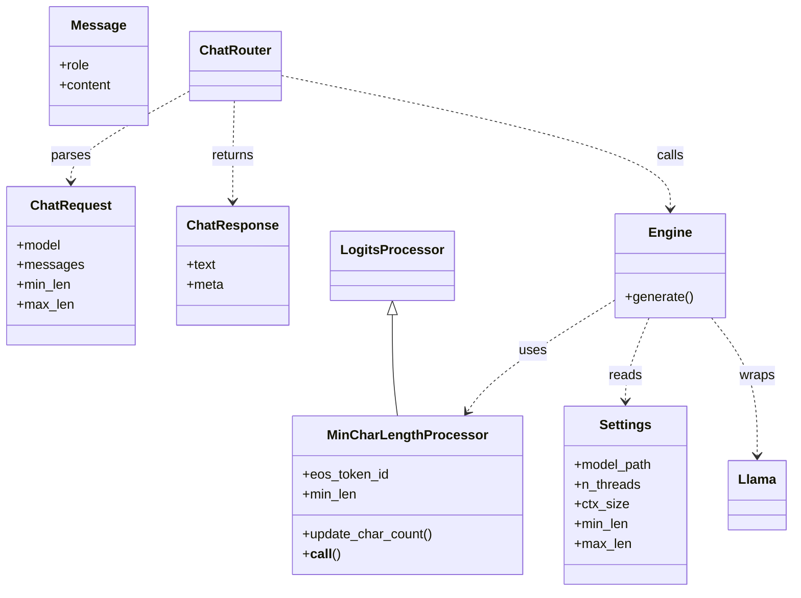
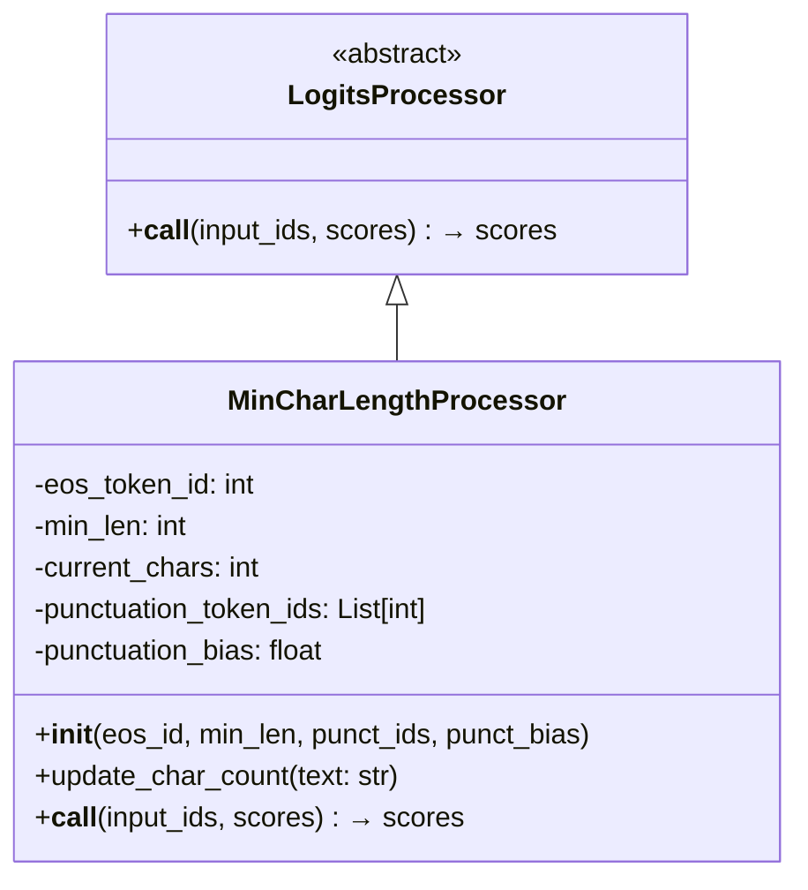
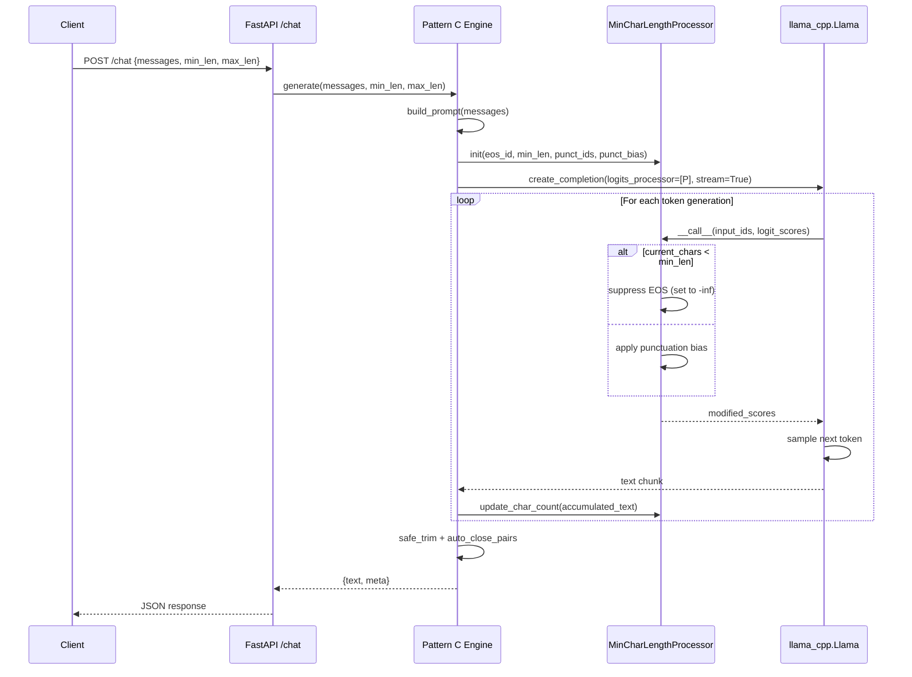

# Pattern C Architecture: Custom LogitsProcessor

## Overview

Pattern C uses a custom logits processor for precise, streaming-friendly control. It dynamically suppresses EOS until minimum character length is reached, then applies positive bias to sentence-ending tokens for natural stops.

## Component Architecture



## Length Control Logic



## Processor Logic Flow




## Class Diagram



## Custom LogitsProcessor Design



## Engine Strategy

### Single-Pass with Dynamic Control
```python
def generate(messages, min_len, max_len, model_override=None):
    # Initialize processor with EOS and punctuation token IDs
    processor = MinCharLengthProcessor(
        eos_token_id=_eos_id,
        min_len=min_c,
        punctuation_token_ids=_punct_ids,
        punctuation_bias=0.3  # Small positive bias
    )
    
    # Generate with processor
    stream = llama.create_completion(
        prompt=prompt,
        max_tokens=max_tokens,
        logits_processor=[processor],
        stream=True
    )
    
    # Update processor as text accumulates
    for chunk in stream:
        text_delta = chunk.get("choices", [{}])[0].get("text", "")
        if text_delta:
            accumulated_text += text_delta
            processor.update_char_count(accumulated_text)
    
    return post_process(accumulated_text)
```

## Configuration Parameters

```bash
# Pattern C specific (.env.example)
MIN_LEN=120                    # Character threshold for EOS release
MAX_LEN=240                    # Hard maximum limit
# PUNCT_BIAS=0.3               # Optional punctuation boost (future)
```

## Token Detection & Preprocessing

```python
def _ensure_llama(model_path=None):
    # Detect EOS token ID
    try:
        _eos_id = _llama.token_eos()
    except Exception:
        try:
            _eos_id = _llama.tokenize("</s>", add_bos=False, special=True)[0]
        except Exception:
            _eos_id = None
    
    # Precompute punctuation token IDs
    _punct_ids = []
    for ch in ["。", "．", ".", "!", "?", "！", "？", "\n"]:
        try:
            toks = _llama.tokenize(ch, add_bos=False, special=False)
            if toks:
                _punct_ids.append(toks[0])
        except Exception:
            pass
```

## Request Flow



## Processor Implementation

```python
class MinCharLengthProcessor:
    def __init__(self, eos_token_id, min_len, punctuation_token_ids=None, punctuation_bias=0.0):
        self.eos_token_id = eos_token_id
        self.min_len = min_len
        self.current_chars = 0
        self.punctuation_token_ids = punctuation_token_ids or []
        self.punctuation_bias = punctuation_bias
    
    def update_char_count(self, text: str):
        """Update character count from accumulated text"""
        self.current_chars = count_chars(text)
    
    def __call__(self, input_ids, scores):
        """Modify logits based on current character count"""
        import torch
        
        # Suppress EOS if under minimum length
        if self.current_chars < self.min_len and self.eos_token_id is not None:
            scores[self.eos_token_id] = float('-inf')
        
        # Boost punctuation tokens after threshold (optional)
        elif self.punctuation_bias > 0 and self.punctuation_token_ids:
            for punct_id in self.punctuation_token_ids:
                if punct_id < len(scores):
                    scores[punct_id] += self.punctuation_bias
        
        return scores
```

## Meta Response Fields

```json
{
  "text": "Generated response with precise length control...",
  "meta": {
    "model": "/path/to/model.gguf",
    "strategy": "logits_processor",
    "min_len": 120,
    "max_len": 240,
    "generated_chars": 156,
    "returned_chars": 156,
    "eos_suppressed": false,
    "usage": {
      "prompt_tokens": 42,
      "completion_tokens": 58,
      "total_tokens": 100
    }
  }
}
```

## Advantages

1. **Single-pass generation:** No second request needed
2. **Streaming compatible:** Works perfectly with SSE
3. **Precise control:** Dynamic adjustment during generation  
4. **Natural endings:** Positive punctuation bias after threshold
5. **Minimal overhead:** Lightweight logit modifications

## Testing Strategy

```python
def test_eos_suppression():
    """Verify EOS is suppressed below min_len threshold"""
    processor = MinCharLengthProcessor(eos_id=2, min_len=100)
    processor.current_chars = 50
    
    scores = torch.zeros(1000)
    scores[2] = 5.0  # High EOS probability
    
    modified = processor([], scores)
    assert modified[2] == float('-inf')

def test_eos_release():
    """Verify EOS is released after min_len threshold"""  
    processor = MinCharLengthProcessor(eos_id=2, min_len=100)
    processor.current_chars = 120
    
    scores = torch.zeros(1000)
    scores[2] = 5.0
    
    modified = processor([], scores)
    assert modified[2] == 5.0  # Unchanged

def test_punctuation_bias():
    """Verify punctuation gets positive bias after threshold"""
    processor = MinCharLengthProcessor(
        eos_id=2, min_len=100, 
        punctuation_token_ids=[10, 11], 
        punctuation_bias=0.5
    )
    processor.current_chars = 120
    
    scores = torch.zeros(1000)
    scores[10] = 2.0
    
    modified = processor([], scores)
    assert modified[10] == 2.5  # Boosted
```

## Performance Characteristics

- **Latency:** Minimal overhead per token (~0.1ms)
- **Memory:** Small constant memory footprint
- **Streaming:** Excellent streaming performance
- **Accuracy:** Precise character-level control

## Thread Safety

```python
_llama_lock = threading.Lock()
_llama = None

def _ensure_llama(model_path=None):
    """Thread-safe model initialization"""
    global _llama
    if _llama is not None:
        return _llama
    with _llama_lock:
        if _llama is None:
            _llama = Llama(model_path=model_path, ...)
    return _llama
```

## Recommended Settings

```bash
# Production settings
MIN_LEN=120          # Reasonable minimum
MAX_LEN=240          # Controlled maximum  
TEMPERATURE=0.7      # Balanced creativity
TOP_P=0.95           # Good diversity
```

This pattern provides the most precise control while maintaining excellent streaming performance and natural text quality.